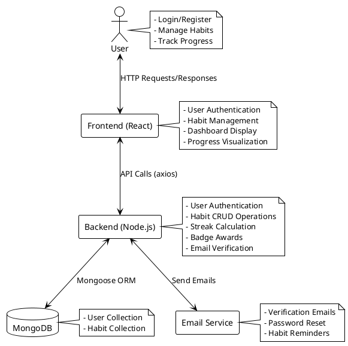
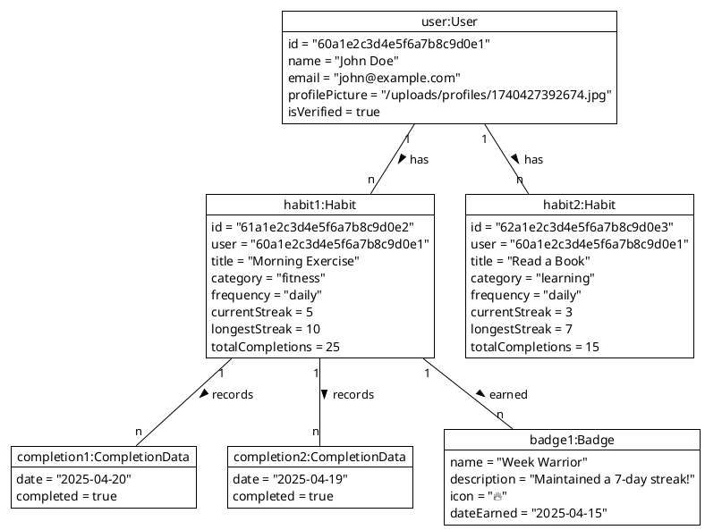
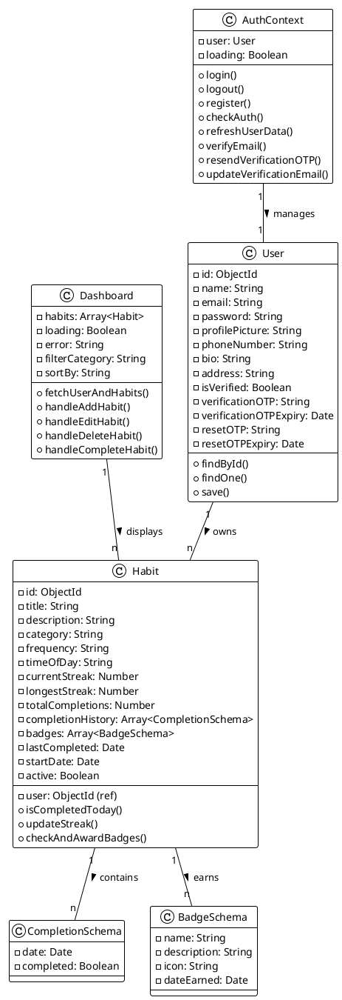
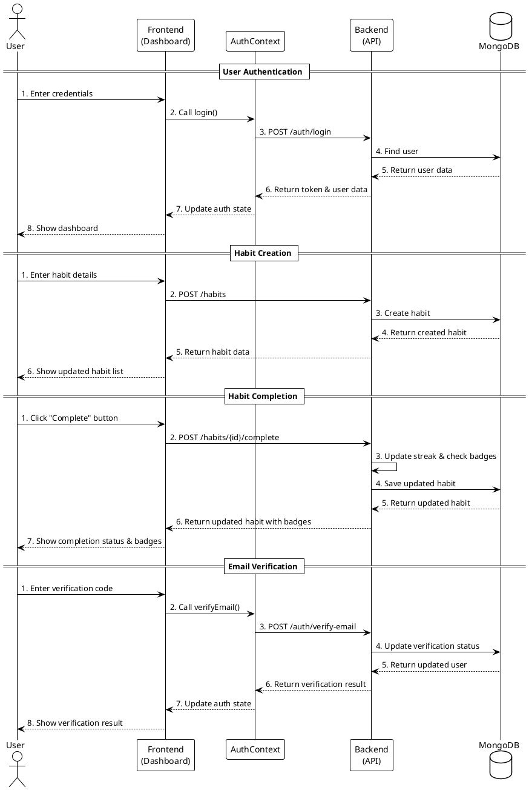
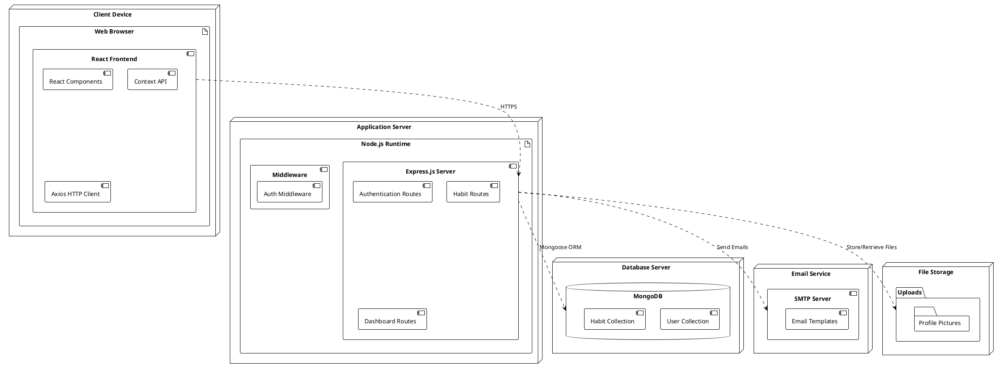
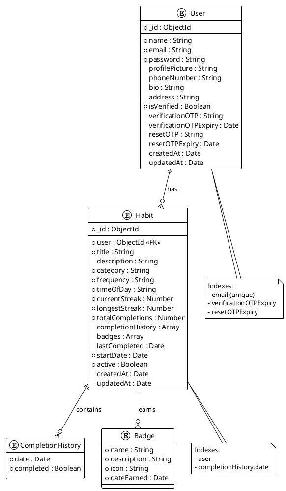

# PlantUML Code for Project Diagrams

## 1. Data Flow Diagram (DFD)

## 2. Object Diagram

## 3. Class Diagram

## 4. Collaboration Diagram

## 5. Deployment Diagram

## 6. Table Design (Database Schema)

## How to Use These Diagrams

1. Copy the PlantUML code for the diagram you want to generate
2. Paste it into a PlantUML editor or renderer:
   - Online: [PlantUML Web Server](https://www.plantuml.com/plantuml/uml/)
   - VS Code: Install the PlantUML extension
   - JetBrains IDEs: Install the PlantUML integration plugin
3. Generate the diagram

These diagrams provide a comprehensive view of the application's architecture, data flow, and component interactions.